# Portfolio Hub Sitemap

This document maps out the structure of the **Full Portfolio Hub** website, including the public-facing pages, sections, and administrative zones.

## 🗺️ Visual Architecture

```mermaid
graph TD
    %% Main Entry
    Root[Index /] --> Home[Home Page]
    Root --> BlogRoot[Blog System /blog]
    Root --> AdminRoot[Admin Panel /admin]

    %% Home Page Sections
    subgraph HomeSections [Home Sections]
        Home --> Hero[Hero Section]
        Home --> About[About Me]
        Home --> Experience[Work Experience]
        Home --> Projects[Featured Projects]
        Home --> Certs[Certifications]
        Home --> Hack[Hackathons]
        Home --> Contact[Contact Form]
    end

    %% Blog System
    subgraph BlogSystem [Blog System]
        BlogRoot --> Listing[Blog Listing]
        Listing --> Post[Individual Blog Post /blog/:slug]
    end

    %% Admin Panel
    subgraph AdminPanel [Admin Zone]
        AdminRoot --> BlogList[Blog Management /admin/blogs]
        BlogList --> BlogNew[Create New Post /admin/blog/new]
        BlogList --> BlogEdit[Edit Existing Post /admin/blog/edit/:id]
    end

    %% Styling
    style AdminRoot fill:#331111,stroke:#ff5555
    style Home fill:#113311,stroke:#55ff55
    style BlogRoot fill:#111133,stroke:#5555ff
```

## 📄 Detailed Route Definitions

| Route | Component | Description |
| :--- | :--- | :--- |
| `/` | `Home` | Main portfolio landing page with multiple sections. |
| `/blog` | `BlogListing` | List of all published blog posts. |
| `/blog/:slug` | `BlogPost` | Detailed view of a specific blog post. |
| `/admin/blogs` | `BlogList` | Dashboard to view, delete, and manage blog posts. |
| `/admin/blog/new` | `BlogEditor` | Form to create a new blog post. |
| `/admin/blog/edit/:id` | `BlogEditor` | Form to edit an existing blog post. |

---

## 🏗️ Section Breakdown (One-Page Portfolio)

The homepage is designed as a single-page application (SPA) with the following interactive sections:

1.  **Navbar**: Sticky navigation with scroll-to-section links.
2.  **Hero**: Impactful introduction with branding.
3.  **About**: Detailed bio and background.
4.  **Experience**: Professional timeline and roles.
5.  **Projects**: Showcase of development work with links.
6.  **Certifications**: Professional badges and achievements.
7.  **Hackathons**: Competitive coding history and wins.
8.  **Contact**: Lead generation and messaging form.
9.  **Footer**: Copyright information and social links.
